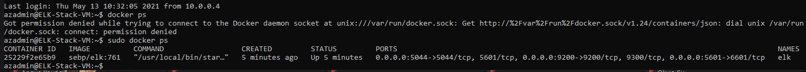

# cyber
This repository consists of scripts and other files to showcase my knowledge from the cybersecurity bootcamp 2021.

## Automated ELK Stack Deployment

The files in this repository were used to configure the network depicted below.

These files have been tested and used to generate a live ELK deployment on Azure. They can be used to either recreate the entire deployment pictured above. Alternatively, select portions of the ansible playbooks files may be used to install only certain pieces of it, such as Filebeat.

  - [elk-playbook.yml](./Ansible/roles/elk-playbook.yml)
  - [dvwa-playbook.yml](./Ansible/roles/dvwa-playbook.yml)
  - [filebeat-playbook.yml](./Ansible/roles/filebeat-playbook.yml)
  - [metricbeat-playbook.yml](./Ansible/roles/metricbeat-playbook.yml)

This document contains the following details:
- Description of the Topology
- Access Policies
- ELK Configuration
  - Beats in Use
  - Machines Being Monitored
- How to Use the Ansible Build

### Description of the Topology

The main purpose of this network is to expose a load-balanced and monitored instance of DVWA, the D*mn Vulnerable Web Application.

Load balancing ensures that the application will be highly available, in addition to using a jump box and restricting direct access to the network.
- Load balancers protect the availability of the system, by helping data move efficiently and delivering resources while conducting health checks to avoid server overloading.
- Jump box is a hardened system that monitor and manages other devices with different security group permissions. It enables managing multiple devices on a network or multiple networks through a single hardened jump box host so you do not have to expose each device.

Integrating an ELK server allows users to easily monitor the vulnerable VMs for changes to the files and system resources.
- Filebeat monitors and collects logfiles and ships them to elasticsearch or logstash.
- Metricbeat monitors and collects metrics from the operating system and services running on the server then ships them to elasticsearch or logstash.

The configuration details of each machine may be found below.
_Note: Use the [Markdown Table Generator](http://www.tablesgenerator.com/markdown_tables) to add/remove values from the table_.

| Name      | Function            | IP Address | OS    |
|-----------|---------------------|------------|-------|
| Jump Box  | Gateway             | 10.0.0.1   | Linux |
| Web-1     | Webserver           | 10.0.0.5   | Linux |
| Web-2     | Webserver           | 10.0.0.7   | Linux |
| Web-3     | Webserver           | 10.0.0.6   | Linux |
| ELK-Stack | Centralized Logging | 10.0.1.4   | Linux |

### Access Policies

The machines on the internal server network are not exposed to the public Internet. 

Only the Jump Box machine can accept connections from the Internet. Access to this machine is only allowed from the following IP addresses:
- <HOME/ADMIN IP ADDRESS>

Machines within the network can only be accessed by Jump Box.
- The ELK-Stack machine is on a different network only the Home/Admin's IP or devices on the the bootcampwest network can access ELK machine. The Home User to access kibana or ssh via jump box, the Web server machines to send log files and data to logstash and elasticsearch.

A summary of the access policies in place can be found in the table below.

| Name     | Publicly Accessible | Allowed IP Addresses                                      |
|----------|---------------------|-----------------------------------------------------------|
| Jump Box | Yes                 | [HOME IP ADDRESS]                                         |
| Web-1    | No                  | 10.0.0.1                                                  |
| Web-2    | No                  | 10.0.0.1                                                  |
| Web-3    | No                  | 10.0.0.1                                                  |
| ELK      | Yes                 | [Home IP Address], 10.0.0.1, 10.0.0.5, 10.0.0.6, 10.0.0.7 |
  

### Elk Configuration

Ansible was used to automate configuration of the ELK machine. No configuration was performed manually, which is advantageous because it allows you to redeploy easily in the future.

The playbook implements the following tasks:
- Install docker.io, python3-pip, docker
- Increase virtual memory limit needed for ELK to run.
- Download and launch elk container

The following screenshot displays the result of running `docker ps` after successfully configuring the ELK instance.

### Target Machines & Beats
This ELK server is configured to monitor the following machines:
- Web-1 - 10.0.0.5
  Web-2 - 10.0.0.7
  Web-3 - 10.0.0.6

We have installed the following Beats on these machines:
- Filebeat
  Metricbeat

These Beats allow us to collect the following information from each machine:
- Metricbeat logs system metrics such as number of resources, CPU usage, memory usage.
  Filebeat collects system log files such as Syslog.
  The beats will send the logs to Elasticsearch or Logstash and admin can visualise the data using kibana.

### Using the Playbook
In order to use the playbook, you will need to have an Ansible control node already configured. Assuming you have such a control node provisioned: 

SSH into the control node and follow the steps below:
- Copy the *playbook.yml files to /etc/ansible/roles and *-config.yml files into /etc/ansible/files
- Update the /etc/ansible/host file to include correct IP configurations for your network. Update the /etc/ansible/ansible.cfg file to include correct usernames for your devices.
- Run the playbook, and navigate to kibana using your browser to check that the installation worked as expected.
> https://[elk ip address]:5601/app/kibana

### TROUBLESHOOTING/FAQ
- _Which file is the playbook? Where do you copy it?_
  All playbooks used in this project have -playbook.yml in the filename. These playbooks are located cyber/Ansible/roles/ of this repository.
  To run the playbook use the following command.
> ansible-playbook elk-playbook.yml
  
- _Which file do you update to make Ansible run the playbook on a specific machine? How do I specify which machine to install the ELK server on versus which to install Filebeat on?_
  The ansible hosts file is used to identify machines as different hosts. In the example with the provided
  [hosts](./Ansible/Hosts) file the elk servers are specified at line 29 and 30.
  web servers are specified on lines 20-27.
  
  Each playbook specifies which host to use within.
  
- _Which URL do you navigate to in order to check that the ELK server is running?_
  
  This URL will take you to the server's kibana page.
  > http://[ELK IP ADDRESS]:5601/app/kibana
  
  This will allow you to check if ELK is receiving data from filebeat. Scroll to the bottom and click Check Data.
  > http://[ELK IP ADDRESS]:5601/app/kibana#/home/tutorial/systemLogs
  
  This will allow you to check if ELK is receiving data from metricbeat.
  > http://[ELK IP ADDRESS]:5601/app/kibana#/home/tutorial/systemMetrics
  
  
### _USEFUL COMMANDS_
  
 Checking docker container list.
  > sudo docker container ls -a
 Start and attach to docker container
  > sudo docker start [container name]
  > sudo docker attach [container name]
 
 Inside ansible container, ping all hosts in .
  > ansible all -m ping
  
 Running a playbook
  > ansible-playbook [playbook yml]
  
  
